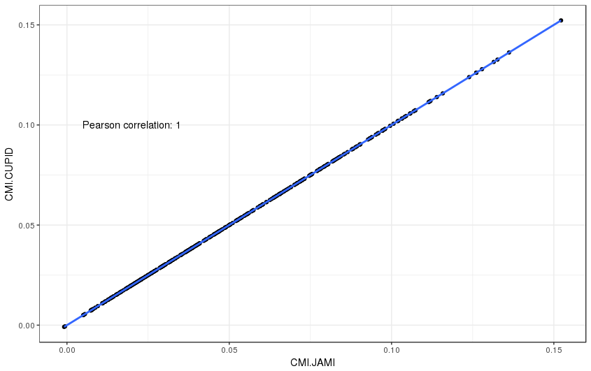
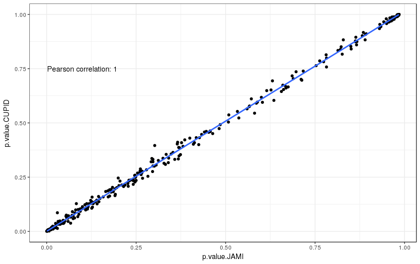
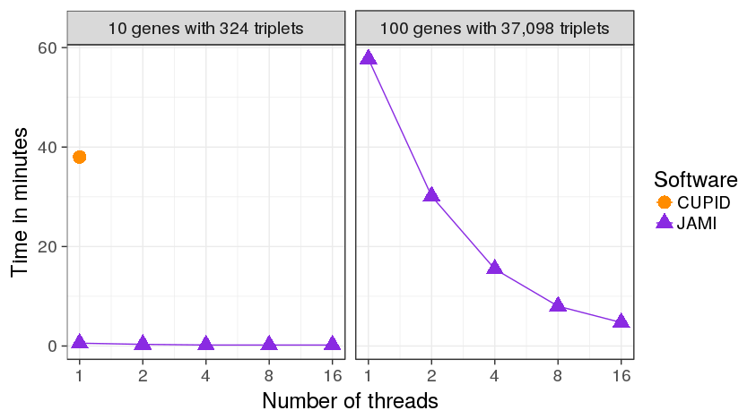

===================
General Description
===================

JAMI is a tool to compute Conditional Mutual Information (CMI)

Defintion of CMI
-----------------------------------------------

CMI is defined ....

=============
Installation
=============

JAMI is implemented in java and thus requires an installation of `Java 1.8 <http://www.oracle.com/technetwork/java/javase/downloads/jre8-downloads-2133155.html>`_ or higher. The advantage of Java is that applications are executed in a virtual machine on any modern operating system such as Windows, MacOS or a Linux derivative such as Ubuntu. You can briefly check if the correct java version is already installed on your computer via 
::
  java -version

which will produce an output similar to this if Java is installed:
::
  java version "1.8.0_144"
  Java(TM) SE Runtime Environment (build 1.8.0_144-b01)
  Java HotSpot(TM) 64-Bit Server VM (build 25.144-b01, mixed mode)

To install this tool download the latest release file from `<https://github.com/SchulzLab/JAMI/releases>`_

The application is conveniently packaged as an executable self-contained JAR file. To start a Java application type on a console
::
  java -jar JAMI.jar

where you may need to either navigate to the directory where you downloaded JAMI to or use a full path such as, for example ``~/Downloads/JAMI.jar`` or ``C:\Downloads\JAMI.jar``. The output should inform you that arguments are missing and give an overview of the expected arguments and options that we will discuss in the next section.

============
Usage
============

JAMI usage overview:
::
  JAMI USAGE:
  java JAMI [options...] gene_expression_file mir_expression_file gene_mir_interactions
  FILE            : gene expression data
  FILE            : miRNA expression data
  FILE            : file defining possible interactions between genes and miRNAs
                   (set format use -set) or triplets of gene-gene-miRNA
  -genes STRING[] : filter for miRNA triplets with this gene as regulator
  -h              : show this usage information (default: false)
  -noheader       : set this option if the input expression files have no
                   headers (default: false)
  -output FILE    : output file (default: JAMI_CMI_results.txt)
  -pcut N         : optional Benjamini Hochberg adjusted p-value cutoff
                   (default: 1.0)
  -perm N         : number of permutations for inferring empirical p-values.
                   defaults to 1000. (default: 1000)
  -restricted     : set this option to restrict analysis to interactions between
                   the selected gene (default: false)
  -set            : set if set notation should be used as opposed to defining
                   individual triplets to be tested (default: false)
  -threads N      : number of threads to use. -1 to use one less than the number
                   of  available CPU cores (default: -1)
  -v              : show JAMI version (default: false)
  -verbose        : show verbose error messages (default: false)

JAMI expect three different arguments for which the order matters.

1.  The path to a gene expression matrix
2.  The path to a miRNA expression matrix
3.  The path to a miRNA interaction file in either set or triplet format 

We will explain what these files look like in section <Input>.

In addition to the arguments, JAMI also accepts options which are used with a '-', the simplest ones being -v and -h which will show the version of JAMI and the usage options, respectively. Other options will be introduced in the <Examples> section.

=====
Input
=====

Expression data
---------------

The format for the two input matrices for gene and miRNA expression are identical:

- The first row may optionally represent a header of sample ids. NOTE: use the -noheader option if your input files do not have a header row.
- The first column contains the gene or miRNA ids, respectively.
- Columns are separated by tabs '\t'.
- Expression values are exclusively numeric.
- Sample order has to be identical between the two expression matrices.

Example:

=============== =============== =============== =============== =============== 
TCGA-HP-A5N0-01	TCGA-DD-A3A8-01	TCGA-ED-A7PY-01	TCGA-G3-A25V-01	TCGA-CC-A1HT-01
=============== =============== =============== =============== ===============
ENSG00000110427	-9.9658         -9.9658        	-4.2934	        -4.6082
ENSG00000105855	-6.5064	        -9.9658	        -4.6082	        -3.458
ENSG00000151746	-0.7346	        -3.458	        -0.6193	        -1.4699
ENSG00000163596	-2.9324	        -3.816	        -1.7322	        -3.6259
ENSG00000106665	1.8323	        1.6466	        0.688	          0.099
ENSG00000123095	-0.4131	        -1.5951	        -5.0116	        0.2029
ENSG00000114529	-5.0116	        -3.816	        -5.0116	        -2.6349
ENSG00000106348	2.0147	        1.3735	        0.3573	        2.236
ENSG00000100767	-0.5332	        -2.1779	        0.3346	        1.1184
ENSG00000135631	2.8301	        2.5338	        1.816	          2.9488
=============== =============== =============== =============== ===============

JAMI can interpret two different formats to define ceRNA interaction triplets (gene-gene-miRNA). In the simple triplet format, the interactions are defined directly by the user:

- The header is optional (do not forget to use the -noheader option in this case). 
- The first column denotes the regulating gene (also called modulator).
- The second column denotes the target gene.
- The third column denotes the miRNA mediating the interaction.
- Columns are separated by tabs '\t'.

=============== =============== ============
geneA	          geneB	          mirnas
=============== =============== ============
ENSG00000110427	ENSG00000105855	MIMAT0000077
ENSG00000110427	ENSG00000105855	MIMAT0000265
ENSG00000110427	ENSG00000105855	MIMAT0000268
=============== =============== ============

In the more general set format, the user defines in each line all potential miRNA binding partners of a gene. These are typically miRNAs for which the given gene has well conserved miRNA binding sites. This information may be derived from miRNA interaction databases such as `TargetScan <http://www.targetscan.org>`_ (for predicted interactions) or `miRTarBase <http://mirtarbase.mbc.nctu.edu.tw/php/index.php>`_ (for experimentally validated interactions). 

- The header is optional (do not forget to use the -noheader option in this case). 
- The first column denotes the gene.
- The second column denotes all miRNA binding partners separated by comma ','.

=============== ===================================================
gene	          miRNAs
=============== ===================================================
ENSG00000110427	MIMAT0000068,MIMAT0000077,MIMAT0000090,
ENSG00000105855	MIMAT0000070,MIMAT0000072,MIMAT0000077,MIMAT0000250
ENSG00000151746	MIMAT0000068
=============== ===================================================

The set format is interpreted as follows: For each pair of genes in the set file, shared miRNAs are computed via intersection and corresponding triplets are generated on the fly. 

**NOTE:** In general, arbitrary identifiers can be used for genes and miRNAs as long as they are consistent between the three input formats. This also means that JAMI can easily be applied to other research domains (biological or otherwise) in which the efficient computation of conditional mutual information is of interest.

**NOTE:** JAMI accepts files with gzip compression and recognizes them automatically via their file ending (txt.gz). It is thus not necessary to decrompress such files.

**NOTE:** JAMI will print warnings for genes and miRNAs that are listed in the interaction file but not found in the expression files. However, this will not cause JAMI to stop but to omit such triplets.

======
Output
======

This will produce two output files called JAMI_CMI_results.txt and JAMI_CMI_results_aggregated.txt. The user can change the output file name with the -o option, e.g.:
::
  java -jar JAMI.jar -o my_result.txt 

would produce the output files my_result.txt and my_result_aggregated.txt.

The first file reports for each tested triplet its CMI value, the corresponding p-value obtained via permutating the expression vector of the target gene and an adjusted p-value (using Benjamini Hochberg FDR correction):

=============== =============== ============ ==================== ======= ===================
Source          Target          miRNA        CMI                  p-value p-adjusted
=============== =============== ============ ==================== ======= ===================
ENSG00000100767	ENSG00000123095	MIMAT0004958 0.08226146915070871  0.001   0.0228
ENSG00000163596	ENSG00000114529	MIMAT0000104 0.08044445150026215  0.098   0.36038709677419356
ENSG00000114529	ENSG00000163596	MIMAT0000104 0.021112819830178327 0.277	  0.5811901840490797
=============== =============== ============ ==================== ======= ===================

In addition, the second file aggregates for each pair of genes all tested miRNA triplets with summary statistics, such as minimum, maximum and a Fisher aggregated p-value in the spirit of CUPID/HERMES. 

**NOTE:** Consider the Fisher p-value with caution since the assumption of independence is unlikely to hold for the triplets aggregated here.  

**NOTE:** You may use the option -pcut to impose a cutoff for the Benjamini Hochberg adjusted p-value, e.g.:
::
  java -jar JAMI.jar -pcut 0.05

This p-value cutoff will affect the aggregated file only indirectly. Here significant miRNAs with p-adjusted < pcut are reported in addition to all miRNAs tested. The p-value obtained via Fisher's method is based on all triplets irrespective of the selected cutoff.

==============
Usage Examples
==============

Downloading example data
------------------------

Please download the following files to the directory in which you also saved JAMI.jar:

Gene expression example file
  https://raw.githubusercontent.com/SchulzLab/JAMI/master/data/10_genes_gene_expr.txt
  
miRNA expression example file
  https://raw.githubusercontent.com/SchulzLab/JAMI/master/data/10_genes_mir_expr.txt

Interactions in set format example file
  https://raw.githubusercontent.com/SchulzLab/JAMI/master/data/10_genes_mirna_interactions_set_format.txt

Interactions in triplet format example file
  https://raw.githubusercontent.com/SchulzLab/JAMI/master/data/10_genes_mirna_interactions_triplet_format.txt

These files represent a small testing set with the gene expression of 10 genes across 362 liver cancer patients as well as relevant matched miRNA expression data.

Using JAMI with the triplet format
-------------------------------------------------------

The simplest way to get started with JAMI:
::
  java -jar JAMI.jar 10_genes_gene_expr.txt 10_genes_mir_expr.txt 10_genes_mirna_interactions_triplet_format.txt

Using JAMI with the set format
-------------------------------------------------------

To use the set format we add the option -set:
::
  java -jar JAMI.jar -set 10_genes_gene_expr.txt 10_genes_mir_expr.txt 10_genes_mirna_interactions_set_format.txt

Using JAMI for a subset of genes or a single gene
-------------------------------------------------------

It is not convenient for the user to prepare new interaction files whenever the gene(s) of interest change. JAMI thus provides the option to select one or several genes via the option -genes.

For a single gene:
::
  java -jar JAMI.jar 10_genes_gene_expr.txt 10_genes_mir_expr.txt 10_genes_mirna_interactions_triplet_format.txt  -genes ENSG00000106665

For multiple genes and triplet format:
::
  java -jar JAMI.jar 10_genes_gene_expr.txt 10_genes_mir_expr.txt 10_genes_mirna_interactions_triplet_format.txt  -genes ENSG00000106665 ENSG00000110427

**NOTE:** The -genes option has to come after the input file arguments since we can otherwise not discern between specified genes and input files.

**NOTE:** When selecting genes only triplets will be generated in which the gene of interest is the modulating entity. The reverse interactions where the selected gene is the target is not considered.

Of course this also works for the set format:
java -jar JAMI.jar 10_genes_gene_expr.txt 10_genes_mir_expr.txt 10_genes_mirna_interactions_set_format.txt -set  -genes ENSG00000106665 ENSG00000110427

For the set input file we offer an additional option -restricted in which only interactions betweeen the selected genes are considered:
::
  java -jar JAMI.jar 10_genes_gene_expr.txt 10_genes_mir_expr.txt 10_genes_mirna_interactions_triplet_format.txt  -genes ENSG00000106665 ENSG00000110427 -restricted

===================================================================
Use case: A ceRNA network constructed from TCGA breast cancer data
===================================================================

Here we consider a real world example of using JAMI for extracting a small ceRNA regulatory network from TCGA breast cancer data. Specifically, we want to reproduce the network between coding and non-coding ceRNAs as shown in `Tay et al., Nature 2014, Figure 1 <https://www.nature.com/nature/journal/v505/n7483/fig_tab/nature12986_F1.html>`_. There, the authors considered the following genes:

- PTENP1
- PTEN
- CNOT6L
- VAPA
- ZEB2
- CD34
- VCAN
- FN1
- RB1
- CDC42
- CD44
- Col1a1

For our usecase we need the following data sets:

TCGA breast cancer gene and miRNA expression data (transcripts per million values obtained from RNA-seq data)
  https://xenabrowser.net/datapages/?cohort=TCGA%20Pan-Cancer%20(PANCAN)

miRcode database reporting on conserved miRNA binding sites for coding and non-coding genes
  http://www.mircode.org/mircode_highconsfamilies.txt.gz

The miRcode database reports miRNA binding sites per miRNA family such that we first have to map each miRNA family to the mature miRNAs (MIMATs) reported in the TCGA data. We converted the result of this procedure to the JAMI set format and provide the corresponding file here for convenience.

miRcode in JAMI set format
 https://raw.githubusercontent.com/SchulzLab/JAMI/master/data/mircode_set_format.txt.gz

**NOTE:** You do no need to decompress this file. As mentioned before, JAMI can handle gzip compressed files automatically.

TODO CONTINUE HERE

=====================================
Performance and Advantages over CUPID
=====================================

JAMI implements conditional mutual information as proposed by Sumazin et al. in their software tool CUPID. The following plot illustrates that JAMI reproduces the CMI values computed by CUPID:

As well as the p-values with 1000 permutations:

We propagate the use of JAMI instead of CUPID due to the following advantages:

- CUPID is implemented in Matlab whereas the JAMI implementation makes use of efficient data structures implemented in Java, leading to a drastic improvement in the performance even in a single thread.
- JAMI implements multi-threaded processing of triplets and thus achieves a further performance gain on multi-core architectures and high-performance computing environments.
- CUPID requires separate expression and miRNA interaction files as input for every pair of gene. In contrast, JAMI accepts a single gene and a single miRNA expression matrix and offers great flexibility with regards to defining the triplets of interest, making it much more convenient to use JAMI in settings where several genes are of interest. 
- The triplet format further allows for splitting the workload conveniently across a distributed compute infrastructure. 
- The use of Matlab requires a license whereas JAMI is completly free to use.

The following plot illustrates the performance gain in single and multi-threaded application on two test sets:

- A small set of 324 interactions between 10 genes meant to illustrate the performance gain in relation to CUPID.
- A larger set of 37,098 interactions between 100 genes meant to illustrate the advantage of parallel processing.

**NOTE:** JAMI follows the default of Java 8 for parallel processing and uses one less than the number of available cores. However, users can specify the number of threads used by JAMI with the option -t.

**NOTE:** The processing time strongly depends on the number of permutations produced to infer p-values. The default is 1000 as in CUPID and can be adjusted with option -perm.

**NOTE:** We only consider step III of the CUPID software tool for a fair comparison. 
