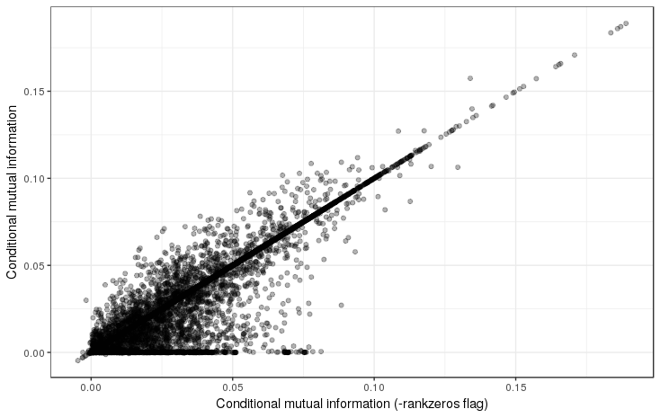
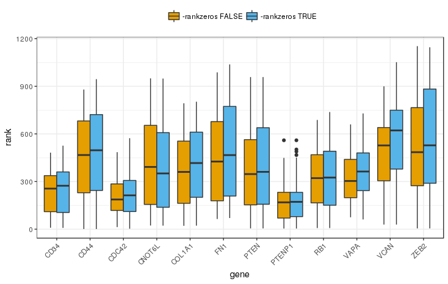

JAMI - Fast computation of conditional mutual information for ceRNA network inference
======================================================================================

===================
General Description
===================

This document describes the usage of the JAMI software. Source code and executables are available on `github <https://github.com/SchulzLab/JAMI>`_. 

The goal of JAMI is to infer ceRNA networks from paired gene and miRNA expression data.
The ceRNA hypothesis proposed by Salmena et al. [Salmena2011]_ suggests that mRNA transcript are in competition over a limited pool of miRNAs they share binding sites for. A competing endogenous RNA is thus a mRNA that excerts regulatory control over the expression of other mRNAs (coding or non-coding genes) via draining them of repressive miRNAs. To quantify the regulatory effect of one gene (the modulator) over another gene (the target) via a specific miRNA, Sumazin et al. [Sumazin2011]_ proposed the use of conditional mutual information, which was implemented as part of the CUPID software [Chiu2015]_ implemented in Matlab. Here we present JAMI, a tool we implemented in Java with the aim of speeding up the computation of CMI to a level that permits large-scale computations of thousands of such interactions in reasonable time.

Conditional Mutual Information
------------------------------

While mutual information quantifies how much one random variable can tell us about another one, conditional mutual information expands on this by quantifying how much one random variable can tell us about another one given a third. 

Mutual information can be defined for discrete random variables :math:`X`, :math:`Y` as the difference in entropy.

.. math::
  I(X;Y) = H(X) + H(Y) - H(X,Y).

This notion can be extended for CMI like this:

.. math::
  I(X;Y|Z) = H(X,Z) + H(Y,Z) - H(X,Y,Z) - H(Z).

where Z is a candidate gene regulating X via miRNA Y. 

Analogous to CUPID, we use the adaptive paritioning approach proposed by Darbellay and Vajda [Darbellay99]_ to compute CMI values via estimating the entropies. While several methods exist for estimating mutual information, Darbellay and Vajda demonstrated that their approach showed similar performance compared to parametric alternatives while having the advantage of being applicable to any kind of distribution. Darbellay and Vajda show that the mutual information of :math:`X` and :math:`Y` can be computed by recursively splitting :math:`X * Y` into four smaller rectangles until the squares are balanced, i.e. until conditional independence is achieved. In CUPID and JAMI this is extended to splitting cubes :math:`X * Y * Z` into eight smaller cubes until balance is achieved. The contribution of the individual small cubes is then summed up to obtain the final estimation of the CMI value. See [Darbellay99]_ for details.

=============
Installation
=============

JAMI is implemented in Java and thus requires an installation of `Java 1.8 <http://www.oracle.com/technetwork/java/javase/downloads/jre8-downloads-2133155.html>`_ or higher. The advantage of Java is that applications are executed in a virtual machine on any modern operating system such as Windows, MacOS or a Linux derivative such as Ubuntu. You can briefly check if the correct java version is already installed on your computer via 
::
  java -version

which will produce an output similar to this if Java is installed:
::
  java version "1.8.0_144"
  Java(TM) SE Runtime Environment (build 1.8.0_144-b01)
  Java HotSpot(TM) 64-Bit Server VM (build 25.144-b01, mixed mode)

To install this tool download the latest release file from `<https://github.com/SchulzLab/JAMI/releases>`_

The application is conveniently packaged as an executable self-contained JAR file. To start a Java application type on a console
::
  java -jar JAMI.jar

where you may need to either navigate to the directory where you downloaded JAMI to or use a full path such as, for example ``~/Downloads/JAMI.jar`` or ``C:\Downloads\JAMI.jar``. The output should inform you that arguments are missing and give an overview of the expected arguments and options that we will discuss in the next section.

============
Usage
============

JAMI usage overview:
::
  JAMI USAGE:
  java JAMI [options...] gene_expression_file mir_expression_file gene_mir_interactions
  FILE            : gene expression data
  FILE            : miRNA expression data
  FILE            : file defining possible interactions between genes and miRNAs
                    (set format use -set) or triplets of gene-gene-miRNA
  -batch N        : number of triplets in each batch. affects overhead of
                    multi-threaded computation (default: 100)
  -genes STRING[] : filter for miRNA triplets with this gene or these genes as
                    regulator
  -h              : show this usage information
  -noheader       : set this option if the input expression files have no headers
  -nozeros        : set this flag to ignore duplicated zero expression values.
                   Otherwise JAMIwill group duplicates of the lowest values
                   such as 0 or the smallest negative value in log scaled data.
                   (default: false)
  -output FILE    : output file (default: JAMI_CMI_results.txt)
  -pchi N         : significance level for the chi-squared test in adaptive
                   partitioning (default: 0.05)
  -pcut N         : optional Benjamini Hochberg adjusted p-value cutoff
                    (default: 1.0)
  -perm N         : number of permutations for inferring empirical p-values.
                    (default: 1000)
  -restricted     : set this option to restrict analysis to interactions between
                    the selected genes
  -set            : set if set notation should be used as opposed to defining
                    individual triplets to be tested
  -threads N      : number of threads to use. -1 to use one less than the number
                    of available CPU cores (default: -1)
  -v              : show JAMI version
  -verbose        : show verbose error messages

JAMI expect three arguments for which the order matters.

1.  The path to a gene expression matrix
2.  The path to a miRNA expression matrix
3.  The path to a miRNA interaction file in either set or triplet format 

We will explain what these files look like in section `Input`_.

In addition to the arguments, JAMI also accepts options which are used with a '-', the simplest ones being -v and -h which will show the version of JAMI and the usage options, respectively. Other options will be introduced in the `Usage Examples`_ section.

=====
Input
=====

Expression data
---------------

The format for the two input matrices for gene and miRNA expression are identical:

- The first row may optionally represent a header of sample ids. NOTE: use the -noheader option if your input files do not have a header row.
- The first column contains the gene or miRNA ids, respectively.
- Columns are separated by tabs '\t'.
- Expression values are exclusively numeric.
- Sample order has to be identical between the two expression matrices.

Example:

=============== =============== =============== =============== =============== 
TCGA-HP-A5N0-01	TCGA-DD-A3A8-01	TCGA-ED-A7PY-01	TCGA-G3-A25V-01	TCGA-CC-A1HT-01
=============== =============== =============== =============== ===============
ENSG00000110427	-9.9658         -9.9658        	-4.2934	        -4.6082
ENSG00000105855	-6.5064	        -9.9658	        -4.6082	        -3.458
ENSG00000151746	-0.7346	        -3.458	        -0.6193	        -1.4699
ENSG00000163596	-2.9324	        -3.816	        -1.7322	        -3.6259
ENSG00000106665	1.8323	        1.6466	        0.688	          0.099
ENSG00000123095	-0.4131	        -1.5951	        -5.0116	        0.2029
ENSG00000114529	-5.0116	        -3.816	        -5.0116	        -2.6349
ENSG00000106348	2.0147	        1.3735	        0.3573	        2.236
ENSG00000100767	-0.5332	        -2.1779	        0.3346	        1.1184
ENSG00000135631	2.8301	        2.5338	        1.816	          2.9488
=============== =============== =============== =============== ===============

JAMI can interpret two different formats to define ceRNA interaction triplets (gene-gene-miRNA). In the simple triplet format, the interactions are defined directly by the user:

- The header is optional (do not forget to use the -noheader option in this case). 
- The first column denotes the regulating gene (also called modulator).
- The second column denotes the target gene.
- The third column denotes the miRNA mediating the interaction.
- Columns are separated by tabs '\t'.

=============== =============== ============
geneA	          geneB	          mirnas
=============== =============== ============
ENSG00000110427	ENSG00000105855	MIMAT0000077
ENSG00000110427	ENSG00000105855	MIMAT0000265
ENSG00000110427	ENSG00000105855	MIMAT0000268
=============== =============== ============

In the more general set format, the user defines in each line all potential miRNA binding partners of a gene. These are typically miRNAs for which the given gene has well conserved miRNA binding sites. This information may be derived from miRNA interaction databases such as `TargetScan <http://www.targetscan.org>`_ (for predicted interactions) or `miRTarBase <http://mirtarbase.mbc.nctu.edu.tw/php/index.php>`_ (for experimentally validated interactions). 

- The header is optional (do not forget to use the -noheader option in this case). 
- The first column denotes the gene.
- The second column denotes all miRNA binding partners separated by comma ','.

=============== ===================================================
gene	          miRNAs
=============== ===================================================
ENSG00000110427	MIMAT0000068,MIMAT0000077,MIMAT0000090,
ENSG00000105855	MIMAT0000070,MIMAT0000072,MIMAT0000077,MIMAT0000250
ENSG00000151746	MIMAT0000068
=============== ===================================================

The set format is interpreted as follows: For each pair of genes in the set file, shared miRNAs are computed via intersection and corresponding triplets are generated on the fly. 

**NOTE:** In general, arbitrary identifiers can be used for genes and miRNAs as long as they are consistent between the three input formats. This also means that JAMI can easily be applied to other research domains (biological or otherwise) in which the efficient computation of conditional mutual information is of interest.

**NOTE:** JAMI accepts files with gzip compression and recognizes them automatically via their file ending (txt.gz). It is thus not necessary to decrompress such files.

**NOTE:** JAMI will print warnings for genes and miRNAs that are listed in the interaction file but not found in the expression files. However, this will not cause JAMI to stop but to omit such triplets.

======
Output
======

This will produce two output files called JAMI_CMI_results.txt and JAMI_CMI_results_aggregated.txt. The user can change the output file name with the -o option, e.g.:
::
  java -jar JAMI.jar -o my_result.txt 

would produce the output files my_result.txt and my_result_aggregated.txt.

The first file reports for each tested triplet its CMI value, the corresponding p-value obtained via permutating the expression vector of the target gene and an adjusted p-value (using Benjamini Hochberg FDR correction):

=============== =============== ============ ==================== ======= ===================
Source          Target          miRNA        CMI                  p-value p-adjusted
=============== =============== ============ ==================== ======= ===================
ENSG00000100767	ENSG00000123095	MIMAT0004958 0.08226146915070871  0.001   0.0228
ENSG00000163596	ENSG00000114529	MIMAT0000104 0.08044445150026215  0.098   0.36038709677419356
ENSG00000114529	ENSG00000163596	MIMAT0000104 0.021112819830178327 0.277	  0.5811901840490797
=============== =============== ============ ==================== ======= ===================

In addition, the second file aggregates for each pair of genes all tested miRNA triplets with summary statistics, such as minimum, maximum and a Fisher aggregated p-value in the spirit of CUPID/HERMES. 

**NOTE:** Consider the Fisher p-value with caution since the assumption of independence is unlikely to hold for the triplets aggregated here.  

**NOTE:** You may use the option -pcut to impose a cutoff for the Benjamini Hochberg adjusted p-value, e.g.:
::
  java -jar JAMI.jar -pcut 0.05

This p-value cutoff will affect the aggregated file only indirectly. Here significant miRNAs with p-adjusted < pcut are reported in addition to all miRNAs tested. The p-value obtained via Fisher's method is based on all triplets irrespective of the selected cutoff.

==============
Usage Examples
==============

Downloading example data
------------------------

Please download the following files to the directory in which you also saved JAMI.jar:

Gene expression example file
  https://raw.githubusercontent.com/SchulzLab/JAMI/master/data/10_genes_gene_expr.txt
  
miRNA expression example file
  https://raw.githubusercontent.com/SchulzLab/JAMI/master/data/10_genes_mir_expr.txt

Interactions in set format example file
  https://raw.githubusercontent.com/SchulzLab/JAMI/master/data/10_genes_mirna_interactions_set_format.txt

Interactions in triplet format example file
  https://raw.githubusercontent.com/SchulzLab/JAMI/master/data/10_genes_mirna_interactions_triplet_format.txt

These files represent a small testing set with the gene expression of 10 genes across 362 liver cancer patients as well as relevant matched miRNA expression data.

Using JAMI with the triplet format
-------------------------------------------------------

The simplest way to get started with JAMI:
::
  java -jar JAMI.jar 10_genes_gene_expr.txt 10_genes_mir_expr.txt 10_genes_mirna_interactions_triplet_format.txt

Using JAMI with the set format
-------------------------------------------------------

To use the set format we add the option -set:
::
  java -jar JAMI.jar -set 10_genes_gene_expr.txt 10_genes_mir_expr.txt 10_genes_mirna_interactions_set_format.txt

Using JAMI for a subset of genes or a single gene
-------------------------------------------------------

It is not convenient for the user to prepare new interaction files whenever the gene(s) of interest change. JAMI thus provides the option to select one or several genes via the option -genes.

For a single gene:
::
  java -jar JAMI.jar 10_genes_gene_expr.txt 10_genes_mir_expr.txt 10_genes_mirna_interactions_triplet_format.txt  -genes ENSG00000106665

For multiple genes and triplet format:
::
  java -jar JAMI.jar 10_genes_gene_expr.txt 10_genes_mir_expr.txt 10_genes_mirna_interactions_triplet_format.txt  -genes ENSG00000106665 ENSG00000110427

**NOTE:** The -genes option has to come after the input file arguments since we can otherwise not discern between specified genes and input files.

**NOTE:** When selecting genes only triplets will be generated in which the gene of interest is the modulating entity. The reverse interactions where the selected gene is the target is not considered.

Of course this also works for the set format:
::
  java -jar JAMI.jar 10_genes_gene_expr.txt 10_genes_mir_expr.txt 10_genes_mirna_interactions_set_format.txt -set  -genes ENSG00000106665 ENSG00000110427

For the set input file we offer an additional option -restricted in which only interactions betweeen the selected genes are considered:
::
  java -jar JAMI.jar 10_genes_gene_expr.txt 10_genes_mir_expr.txt 10_genes_mirna_interactions_triplet_format.txt  -genes ENSG00000106665 ENSG00000110427 -restricted

===================================================================
Use case: A ceRNA network constructed from TCGA breast cancer data
===================================================================

Here we consider a real world example of using JAMI for extracting a small ceRNA regulatory network from TCGA breast cancer data. Specifically, we want to reproduce the network between coding and non-coding ceRNAs as shown in `Figure 1 <https://www.nature.com/nature/journal/v505/n7483/fig_tab/nature12986_F1.html>`_ of [Tay2014]_. There, the authors considered the following genes:

- PTENP1
- PTEN
- CNOT6L
- VAPA
- ZEB2
- CD34
- VCAN
- FN1
- RB1
- CDC42
- CD44
- Col1a1

For our use case we need the following data sets:

TCGA breast cancer gene and miRNA expression data (transcripts per million values obtained from RNA-seq data)
  https://xenabrowser.net/datapages/?cohort=TCGA%20Pan-Cancer%20(PANCAN)

miRcode database reporting on conserved miRNA binding sites for coding and non-coding genes
  http://www.mircode.org/mircode_highconsfamilies.txt.gz

The miRcode database reports miRNA binding sites per miRNA family such that we first have to map each miRNA family to the mature miRNAs (MIMATs) reported in the TCGA data. We converted the result of this procedure to the JAMI set format and provide the corresponding file here for convenience.

miRcode in JAMI set format
 https://raw.githubusercontent.com/SchulzLab/JAMI/master/data/mircode_set_format.txt.gz

**NOTE:** You do no need to decompress this file, as JAMI can handle gzip compressed files automatically.

**NOTE:** The TCGA data uses the version number of the Ensembl gene ids whereas the mircode data uses the unversioned ids. Interested users thus need to be careful to omit the last part of the gene id, e.g. ENSG00000100767.5 would be ENSG00000100767).

We next process these data with JAMI to understand how many miRNAs are involved in the cross-talk of these well-known ceRNAs in breast cancer. The following command will compute CMI values and p-values for approximately 10,000 interactions (triplets).

::
  java -jar JAMI.jar \
  breast_invasive_carcinoma_cancer_gene_expr.txt.gz \
  breast_invasive_carcinoma_cancer_mir_expr.txt.gz \
  mircode_set_format.txt.gz \
  -genes ENSG00000237984 \
  ENSG00000101558 \
  ENSG00000138767 \
  ENSG00000171862 \
  ENSG00000169554 \
  ENSG00000038427 \
  ENSG00000174059 \
  ENSG00000139687 \
  ENSG00000115414 \
  ENSG00000070831 \
  ENSG00000026508 \
  ENSG00000108821 \
  -set -restricted \
  -output JAMI_BRCA_PTEN_network.txt \
  -pcut 0.01 \
  -perm 10000

We increased the number of permutations to 10,000 (default is 1,000) to obtain a better p-value estimation. This means that we computed a total of :math:`10,000^2 = 1e8` CMI values, which took less then 20 minutes on a 64 core compute server.

The result file can now be used for further research about ceRNA interactions. Here, we show that the result file can be directly imported in `Cytoscape <http://www.cytoscape.org/>`_, a popular tool for network analysis, without further steps. Start up Cytoscape and either click on 'import network from file' in the startup screen or click on File -> Import -> Network -> File... to get to the following screen:

  Supplemental Figure 1: Cytoscape import of JAMI network files.

Here, all column types are inferred correctly and automatically such that you should press OK. 

You can decide wether you want to import the :download:`regular <_static/JAMI_BRCA_PTEN_network.txt>` or the :download:`aggregated <_static/JAMI_BRCA_PTEN_network_aggregated.txt>` result file in Cytoscape, both will work. Below we show an example of the aggregated network where we color the edges by the number of miRNAs that are shared between those two genes with a adjusted p-value < 0.01. Gene pairs with few significant interactions are shown in grey, thin lines, whereas orange thick lines indicate that a gene pair shares many miRNAs with significant CMI values. The top interacting ceRNAs seem to be VCAN and ZEB2 with more than 120 shared miRNAs:

  Supplemental Figure 2: JAMI inferred ceRNA network for known ceRNAs reported in [Tay2014]_.

We arranged nodes according to the Figure 1 in [Tay2014]_ for facilitating a comparison but it appears that the actual ceRNA network is much denser than what was established in the literature. Rearranging this plot in a circular fashion makes it a bit easier on the eye:

  
  Supplemental Figure 3: The same ceRNA network as in Supplemental Figure 2 with circular layout.

=====================================
Performance and Advantages over CUPID
=====================================

JAMI implements conditional mutual information as proposed by Sumazin et al. in their software tool CUPID. The following two plots illustrates that JAMI reproduces the CMI values computed by CUPID (if the -nozeros flag is set, see `Dealing with zero expression values`_ for details). 

.. figure:: _static/cmi_comparison.png

  Supplemental Figure 4: Comparison of CMI values between CUPID and JAMI for a test set of 324 interactions.

As well as the p-values with 1000 permutations:

.. figure:: _static/pval_comparison_1000_permutations.png

  Supplemental Figure 5: Comparison of p-values between CUPID and JAMI for a test set of 324 interactions.

We propagate the use of JAMI instead of CUPID due to the following advantages:

- CUPID is implemented in Matlab whereas the JAMI implementation makes use of efficient data structures implemented in Java, leading to a drastic improvement in the performance even in a single thread.
- JAMI implements multi-threaded processing of triplets and thus achieves a further performance gain on multi-core architectures and high-performance computing environments.
- JAMI can deal with zero expression values (and negative values introduced through pseudocounts in log2-scaled data). See `Dealing with zero expression values`_ for details.
- CUPID requires separate expression and miRNA interaction files as input for every pair of gene. In contrast, JAMI accepts a single gene and a single miRNA expression matrix and offers great flexibility with regards to defining the triplets of interest, making it much more convenient to use JAMI in settings where several genes are of interest. 
- The triplet format further allows for splitting the workload conveniently across a distributed compute infrastructure. 
- The use of Matlab requires a license whereas JAMI is completly free to use.

.. figure:: _static/benchmark.png

 Supplemental Figure 6: Performance gain in single and multi-threaded application on two test sets. Left: A small set of 324 interactions between 10 genes meant to illustrate the performance gain in relation to CUPID. Right: A larger set of 37,098 interactions between 100 genes meant to illustrate the advantage of parallel processing.

**NOTE:** JAMI follows the default of Java 8 for parallel processing and uses one less than the number of available cores. However, users can specify the number of threads used by JAMI with the option -t.

**NOTE:** The processing time strongly depends on the number of permutations produced to infer p-values. The default is 1000 as in CUPID and can be adjusted with option -perm. 

**NOTE:** When computing a large number of permutations for a small number of interactions in multi-threaded mode it is advisable to reduce the batch size with the option -batch. With the default batch size of 100 the work might otherwise be left to a single thread. In contrast, if the number of considered interactions is large it may be helpful to increase the batch size to reduce the overhead of the parallel execution. 

**NOTE:** We only consider step III of the CUPID software tool for a fair comparison. 

===================================
Dealing with zero expression values
===================================

Before conditional mutual information can be computed, JAMI and CUPID transform the real valued input expression values into ranks. Due to this, the algorithm does not handle duplicated values correctly. While duplicates are typically not expected in gene and miRNA expression data, there is one exception. If no expression is measured in a sample (e.g. no reads have been mapped to a gene in next-generation sequencing data), the expression value will be zero. For lowly expressed genes, these zero expression values can make up a sizable fraction of the expression data, thus introducing a considerable bias into the CMI computation. To address this issue, we extended the CMI algorithm in JAMI to handle zero expression values explicitly. More precisely, we introduce a preprocessing step in which zero expression values are split off the initial cube into a series of subcubes in which the corresponding dimension containing zero expression values is collapsed. The resulting square keeps a memory of the zero values that have been collapsed on the third axis in a HashSet to facilitate correct computation. If zero expression values are found on a second dimension this will also be collapsed, resulting in a line. If zero expression values are found on the third axis those samples will be split off and result in a single bin that is not split further. Squares and lines are processed similar to cubes in that they are split at the center until they are balanced according to the chi squared test. In this way, we avoid splitting intervals of zero expression values and assigning arbitrary ranks to these values. This allows us to compute accurate CMI values under the assumption that no other values are duplicated. To identify zero expression values, we check if the minimal expression value is duplicated. Thus, we can also accommodate log2 scaled data in which a pseudocount is added to obtain a large negative value for the zero expression case. For the ceRNA network introduced above, we show that considering zero expression values has a considerable impact on the results: 

 Supplemental Figure 6: Comparison of CMI values when accounting for duplicated zero expression values to the -nozeros mode in which they are ignored. It is evident that the CMI values are affected by this. Notably, the -nozero mode produces positive CMI values even when a gene or miRNA is not expressed.

 Supplemental Figure 7: Comparison of p-values when accounting for duplicated zero expression values to the -nozero mode in which they are ignored. As can be expected from the differences in CMI values shown in Supplemental Figure 6, p-values may change drastically when zero expression values are present.

Accounting for the bias introduced by duplicated zero expression value improves the results of the ceRNA interaction network we computed above. To test this, we iterated through each modulator gene and computed the ranks (highest CMI with rank = 1) of its interaction when accounting for zeros and when not accounting for zeros (-nozeros mode). Next, we identified miRNA interactions with experimental evidence using miRTarBase [Chou2015]_ (version 7, downloaded December 6, 2017). We hypothesize that accounting for zeros improves the ranks of miRNA interactions with experimental evidence. Indeed, for the ceRNA network of Tay et al. [Tay2014]_, we observe a significant improvement in the rank (wilcoxon test p = 0.037 two-sided, 0.019 one-sided).

 Supplemental Figure 8: Significant rank improvement for ceRNA interactions that involve miRNAs targeting the modulator gene and for which experimental evidence was reported in miRTarBase 7. Note that with the -nozero flag set JAMI will behave like CUPID and rank all values irrespective of the occurence of zero expression values.

 Supplemental Figure 9: Ranks of miRNAs for which experimental evidence was reported in miRTarBase 7, here shown for individual modulator genes. Note that with the -nozero flag set JAMI will behave like CUPID and rank all values irrespective of the occurence of zero expression values.

===========
References
===========

.. [Salmena2011] Salmena, Leonardo, Laura Poliseno, Yvonne Tay, Lev Kats, and Pier Paolo Pandolfi. "A ceRNA hypothesis: the Rosetta Stone of a hidden RNA language?." Cell 146, no. 3 (2011): 353-358.
.. [Sumazin2011] Sumazin, Pavel, Xuerui Yang, Hua-Sheng Chiu, Wei-Jen Chung, Archana Iyer, David Llobet-Navas, Presha Rajbhandari et al. "An extensive microRNA-mediated network of RNA-RNA interactions regulates established oncogenic pathways in glioblastoma." Cell 147, no. 2 (2011): 370-381.
.. [Chiu2015] Chiu, Hua-Sheng, David Llobet-Navas, Xuerui Yang, Wei-Jen Chung, Alberto Ambesi-Impiombato, Archana Iyer, Hyunjae Ryan Kim et al. "Cupid: simultaneous reconstruction of microRNA-target and ceRNA networks." Genome research 25, no. 2 (2015): 257-267. 
.. [Darbellay99] Darbellay, Georges A., and Igor Vajda. "Estimation of the information by an adaptive partitioning of the observation space." IEEE Transactions on Information Theory 45, no. 4 (1999): 1315-1321.
.. [Tay2014] Tay, Yvonne, John Rinn, and Pier Paolo Pandolfi. "The multilayered complexity of ceRNA crosstalk and competition." Nature 505, no. 7483 (2014): 344-352.
.. [Chou2015] Chou, Chih-Hung, Nai-Wen Chang, Sirjana Shrestha, Sheng-Da Hsu, Yu-Ling Lin, Wei-Hsiang Lee, Chi-Dung Yang et al. "miRTarBase 2016: updates to the experimentally validated miRNA-target interactions database." Nucleic acids research 44, no. D1 (2015): D239-D247.
